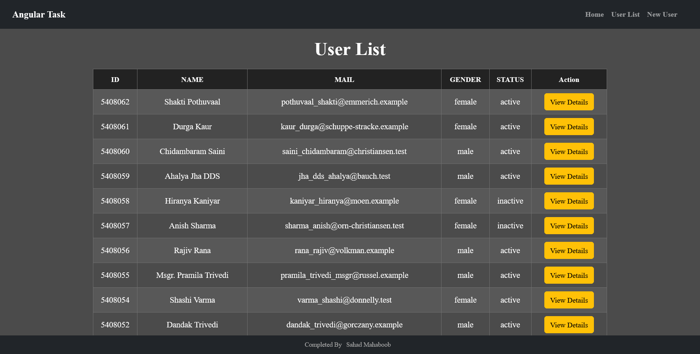
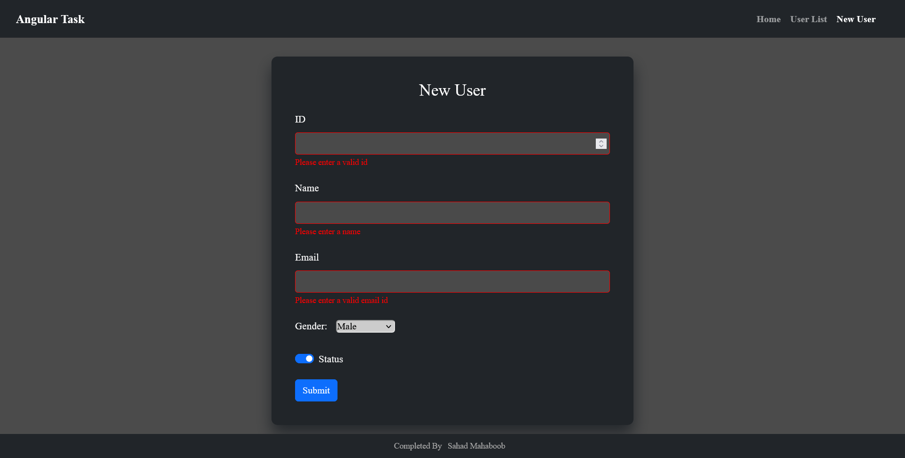
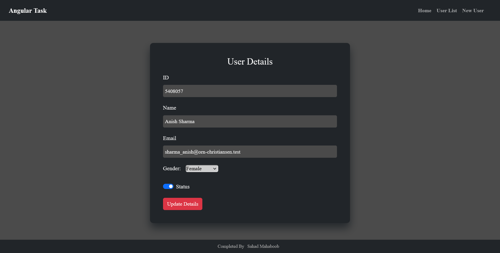

<h1 align = "center"><b>Angular Showcase Task</b></h1>

    <a href="https://angular-showcase-task.vercel.app/" target="_blank">Visit Website</a>

This project involves creating a responsive web and mobile app using Angular, sharing a single codebase. It retrieves user data from a configurable API source and presents it in both list and grid views. Users can add new entries with form validation. It offers detailed user views and internet connectivity checks.

This project is undertaken as part of an Angular task.

## Preview

    

 
 

    

 
 

    

<h5 align="center">Connect with me!</h5>

    

